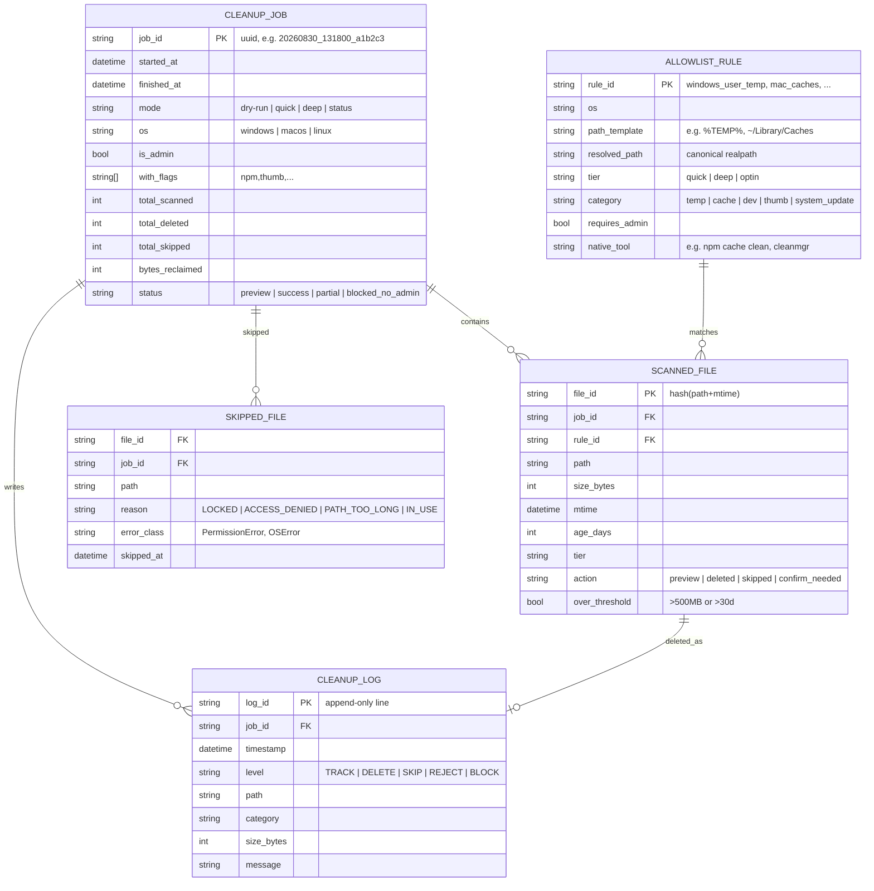

# ERD, hermes-vacuum

> Bukan RDBMS beneran, state disimpan sebagai JSON di `$HERMES_HOME/hermes-vacuum/` ala `disk-cleanup` (`tracked.json`, `cleanup.log`). ERD ini model logik biar konsisten.

## 1. Mermaid ER Diagram



## 2. File State Mapping (fisik)

```
$HERMES_HOME/hermes-vacuum/
├── tracked.json          # array<SCANNED_FILE> + CLEANUP_JOB terakhir
│   {
│     "jobs": [ CLEANUP_JOB ],
│     "last_scan": { "at": "2026-08-30T13:18:00", "total": 842, "reclaimable": 1234567890 }
│   }
├── tracked.json.bak      # backup atomic write (ala disk-cleanup)
└── cleanup.log           # append-only CLEANUP_LOG
    2026-08-30T13:18:00 DELETE /Temp/tmp_abc 12345 temp
    2026-08-30T13:18:01 SKIP   /Temp/locked.db 0 LOCKED PermissionError
```

## 3. Relasi Penting

- `CLEANUP_JOB 1-N SCANNED_FILE`, satu job scan bisa hasilin ribuan file
- `ALLOWLIST_RULE 1-N SCANNED_FILE`, tiap file harus trace ke rule allowlist mana (audit)
- `SCANNED_FILE 1-0/1 SKIPPED_FILE`, kalau `action=skipped`, ada 1 baris skipped dengan reason
- `CLEANUP_LOG` append-only, tiap `DELETE`/`SKIP`/`REJECT` tulis log, tidak pernah overwrite

## 4. Constraints (ponytail)

- `SCANNED_FILE.path` harus `is_safe_path()==True`, kalau false, jangan masuk `SCANNED_FILE`, langsung `REJECT` log
- `CLEANUP_JOB.is_admin==false` + `mode==deep` + `rule.requires_admin==true` → `status=blocked_no_admin`, 0 file terhapus
- `SCANNED_FILE.over_threshold==true` + `mode==quick` → `action=confirm_needed`, jangan `deleted`
- `SKIPPED_FILE.reason` enum terbatas, jangan free text biar bisa di-aggregate ("37 LOCKED" bukan 37 pesan beda)

## 5. Query Contoh (untuk `status`)

```python
# top 10 terbesar
sorted(scanned, key=lambda f: f.size_bytes, reverse=True)[:10]
# breakdown per kategori
group_by(scanned, lambda f: f.category) | sum(size)
# skipped summary
counter(skipped, key=lambda s: s.reason)  # {"LOCKED": 30, "ACCESS_DENIED": 7}
```
