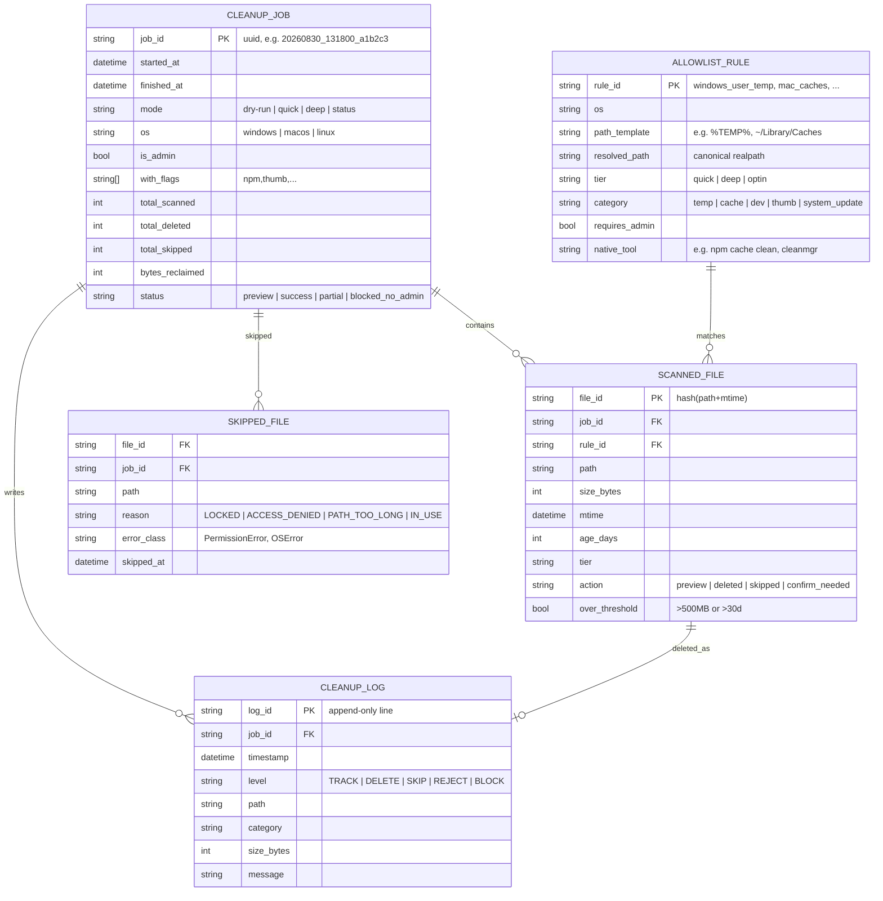

# ERD, hermes-vacuum

> Not a real RDBMS, state is stored as JSON in `$HERMES_HOME/hermes-vacuum/` like `disk-cleanup` (`tracked.json`, `cleanup.log`). This ERD is a logical model to keep behavior consistent.

## 1. Mermaid ER Diagram



## 2. File State Mapping (physical)

```
$HERMES_HOME/hermes-vacuum/
├── tracked.json          # array<SCANNED_FILE> + latest CLEANUP_JOB
│   {
│     "jobs": [ CLEANUP_JOB ],
│     "last_scan": { "at": "2026-08-30T13:18:00", "total": 842, "reclaimable": 1234567890 }
│   }
├── tracked.json.bak      # atomic write backup (like disk-cleanup)
└── cleanup.log           # append-only CLEANUP_LOG
    2026-08-30T13:18:00 DELETE /Temp/tmp_abc 12345 temp
    2026-08-30T13:18:01 SKIP   /Temp/locked.db 0 LOCKED PermissionError
```

## 3. Important Relations

- `CLEANUP_JOB 1-N SCANNED_FILE`, one scan job can produce thousands of files
- `ALLOWLIST_RULE 1-N SCANNED_FILE`, each file must trace to exactly one allowlist rule (audit)
- `SCANNED_FILE 1-0/1 SKIPPED_FILE`, if `action=skipped`, there is one skipped row with a reason
- `CLEANUP_LOG` is append-only, every `DELETE`/`SKIP`/`REJECT` writes a log line, never overwritten

## 4. Constraints (ponytail)

- `SCANNED_FILE.path` must satisfy `is_safe_path()==True`, if false do not insert into `SCANNED_FILE`, write a `REJECT` log directly
- `CLEANUP_JOB.is_admin==false` plus `mode==deep` plus `rule.requires_admin==true` results in `status=blocked_no_admin`, zero files deleted
- `SCANNED_FILE.over_threshold==true` plus `mode==quick` results in `action=confirm_needed`, never `deleted`
- `SKIPPED_FILE.reason` is a closed enum, never free text, so it can be aggregated ("37 LOCKED" not 37 different messages)

## 5. Example Queries (for `status`)

```python
# top 10 largest
sorted(scanned, key=lambda f: f.size_bytes, reverse=True)[:10]
# breakdown per category
group_by(scanned, lambda f: f.category) | sum(size)
# skipped summary
counter(skipped, key=lambda s: s.reason)  # {"LOCKED": 30, "ACCESS_DENIED": 7}
```
